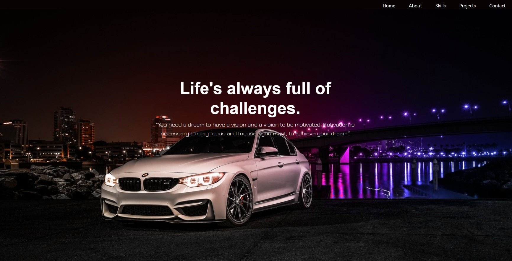

# React Portfolio

## Overview
The development of Frontend Frameworks and CDNs has changed the landscape of web development significantly. With the emergence of new technologies like Bootstrap, jQuery, Node.js and React the future is really bright for web and software development. Having already done my portfolio, this is an attempt to revamp it using React, taking advantage of the new approach and flare that it brings to the table.

## Description
This application is developed to using React, bootstrap and Node.js, with a little bit of CSS to add to the mix. React is the key player this time around and I’ll be using the tools, utilities and vast wealth of resources that has makes it one of the most popular in the industry. What better way is there to demonstrate this than to showcase my work using these very framework. The React Portfolio is a Repo setup to showcase a cross section of my web applications. The website contains my biography, qualifications and other useful information with a contact form should you wish to get in get in touch. This link with take you there. 

## Mock-up

Click [**here**](https://rhanciles.github.io/React-Portfolio/) to visit site.

## Usage
This Repo is made up of the core files and folders related to the task. It contains a folder with an image of the end product and I have added comments to all the relevant sections of the code, highlighting key areas and further explain the design.  The content comprise only that related to the design and I have used seeveral CSS files to simplify and further streamline the design. The UI of the webpage is laid out to maximise the UX of every visitor, such that the need for further guidelines becomes superfluous. Click [**here**](https://rhanciles.github.io/React-Portfolio/) to check it out.

## Feedback
Please feel free to reach out or drop a comment here if you have any questions, queries or suggestions. Otherwise, you can find me on the Slack platform Pod 5, just search for Rod.
